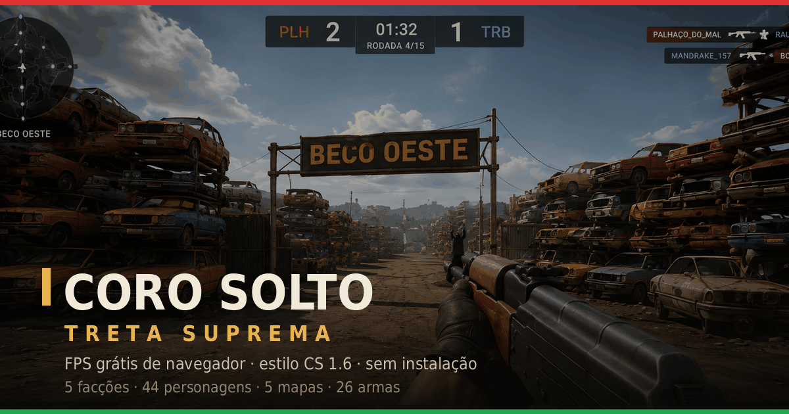

# CORO SOLTO: Treta Suprema

[](LICENSE)
[](https://astro.build)
[](https://threejs.org)



**FPS gratuito de navegador em Three.js**: arena de sniper estilo CS 1.6
(`awp_map`) numa Brasília fictícia e satírica. 5 facções, 44 personagens
originais, 5 mapas, 26 armas, bots, rounds e Capture the Flag. Sem download,
sem instalação, sem cadastro.

> **Hoje o jogo é só contra bots.** Não existe multiplayer entre humanos: um
> `grep RTCPeerConnection` no repositório devolve zero, e não há netcode em
> `public/js/` nem em `src/`. Multiplayer por WebRTC é a maior frente aberta do
> projeto — quando existir, esta linha muda junto com o código, não antes.

▶ **Jogue:** <https://www.csbrasil.online>

> **O jogo já se chamou CS BRASIL.** É o mesmo jogo — o domínio continua o
> mesmo, e o nome antigo segue registrado como nome alternativo pra quem
> procura por ele.

> Este jogo nasceu gerado por IA a partir de um único prompt —
> [o prompt original está em `docs/historico/PROMPT.md`](docs/historico/PROMPT.md).

---

## Comece por aqui

| Você é… | Leia |
|---|---|
| curioso | esta página, e depois <https://www.csbrasil.online> |
| dev novo (ou agente) | [`STATUS.md`](STATUS.md) → [`docs/README.md`](docs/README.md) → [`CONTRIBUTING.md`](CONTRIBUTING.md) |
| quer contribuir hoje | [`docs/issues/`](docs/issues/) — 15 tarefas com arquivos e critério de aceite |
| quer saber o que está quebrado | [`KNOWN-BUGS.md`](KNOWN-BUGS.md) — defeitos com `arquivo:linha` e passo de reprodução |

**Site de documentação** (Docusaurus, com instrumentação de IA, quality gates e
arquitetura): `cd docs && npm install && npm start` → <http://localhost:3000/docs/>.

## Arquitetura

Um repositório, **duas zonas com regras diferentes**:

- **O JOGO — `public/`** · JavaScript vanilla com ES modules, Three.js r160
  vendorizado em `public/vendor/`, **zero build**. Nunca vira framework.
  **Não existe `public/index.html`:** o HTML do jogo é `src/pages/index.astro`,
  servido na rota `/`. (Este README já afirmou o contrário por meses e mandava
  todo dev novo para o arquivo errado.)
- **O SITE — `src/`** · [Astro](https://astro.build) com SSR na Vercel. Landing,
  ranking global, perfis públicos, páginas de conteúdo e as rotas `/api/*`. Aqui
  framework é bem-vindo — mas o jogo continua intocado.

O ranking global vive no **Supabase** (`supabase/`). A `service_role` key fica
só no servidor; a `anon` key é pública por design, e a segurança vem das
policies e dos grants por coluna.

```
STATUS.md              estado de hoje (leia primeiro)
astro.config.mjs       Astro + adapter Vercel · `site` COM www (canonical)
vercel.json            build, headers de segurança (CSP…) e cache
src/
  layouts/Layout.astro shell do site: nav, footer, CSS global, JSON-LD base
  lib/site.ts          nome, host, descrições e @id de JSON-LD (fonte única)
  lib/supabase.ts      client admin (service_role, só no servidor)
  lib/safe-url.ts      allowlist de avatar + fetch com trava de SSRF
  lib/ratelimit.ts     rate limit durável (contado no Postgres)
  data/jogo.ts         armas/mapas/personagens em forma de dado, pro site
  pages/index.astro    O JOGO, na rota `/`
  pages/ranking.astro  leaderboard (SSR, com cache de CDN)
  pages/u/[...path]    perfil público por jogador + badge PNG
  pages/sitemap.xml.ts sitemap dinâmico, cobre os perfis
  pages/api/*          register, submit-match, leaderboard, badge, avatar…
public/                O JOGO (vanilla, zero build)
  js/ vendor/ models/ style.css robots.txt llms.txt og-image.png
  audio/                 ⚠ NÃO versionado — ver "Áudio" abaixo
supabase/              schema, 12 migrations e a ofuscação opcional
tools/                 scripts one-off de asset e pipeline
tools/eval/            o arnês de medição e os portões de qualidade
docs/                  documentação para devs (Docusaurus) + as 15 issues de entrada
```

**Duas pastas NÃO vêm no clone**, por decisão registrada: `public/audio/` (direitos
incertos) e `references/` (telas-alvo da UI e frames de referência, que ficam só na
máquina do dono). O que sobrevive das `references/` são os **números medidos**:
`tools/eval/ref_ui.json` e `tools/eval/ref_viewmodel.json`, esses versionados. Régua que
precisa rodar em CI lê o JSON, nunca o PNG.

## Rodar localmente

**O site completo** (é o modo que você quer — inclui o jogo):

```bash
git clone https://github.com/rubenmarcus/csbrasil.git
cd csbrasil
npm install
cp .env.example .env      # opcional: sem envs, o ranking responde 503 e o resto roda
npm run fetch-audio       # opcional: sem o pacote, o jogo usa sons sintetizados
npm run dev               # http://localhost:4321 — o jogo está em /
```

Build e preview:

```bash
npm run build             # gera dist/ (client + server)
npm run preview           # serve dist/client estaticamente
```

`python3 -m http.server -d public` serve **só os assets** do jogo — o HTML não
está lá. Use `npm run dev`.

## Portão de qualidade

```bash
npm run check        # sintaxe de public/js + invariantes + viewmodel + coice + bots
npm run check:fast   # só sintaxe + ARCH.md atualizado (segundos)
npm run arch         # regenera tools/eval/ARCH.md
```

Nada commita com invariante vermelha. O catálogo do arnês está em
[`tools/eval/README.md`](tools/eval/README.md).

> `npm run check` lê GLBs de `public/models/`. Numa árvore sem os assets
> baixados, `eval:invariants` e `eval:vm` falham com `ENOENT` — é ambiente, não
> regressão.

## Controles

| Tecla | Ação |
| --- | --- |
| W A S D | Mover |
| Mouse | Mirar |
| Shift | Correr |
| **Ctrl ou C** | **Agachar — mira bem mais estável** |
| Espaço | Pular |
| Clique esq. | Atirar |
| Clique dir. | Luneta / ADS |
| R | Recarregar |
| 1 / 2 / 3 | Primária / pistola / faca |
| **Z / X / V** | **Rádio estilo CS (comandos de voz)** |
| **M** | **Trocar de time (a qualquer momento)** |
| Tab | Placar |
| Esc | Pausar |

**Regras:** 4×4 contra bots **por padrão** — o menu aceita de 1 a 8 por lado
(`settings.bots`) — com respawn de **2,2 s** (`public/js/game.js:76`,
`RESPAWN_DELAY`). Round de 1:39; o time com mais abates leva o round; 3 rounds
vencem a partida e a 5ª rodada é o teto. AWP mata com um tiro em qualquer lugar
do corpo. Multikills disparam anúncios estilo Unreal Tournament. Capture the
Flag tem 4 bandeiras e é o padrão em 3 dos 5 mapas.

**Regeneração de vida está DESLIGADA** (decisão do dono, 05/08/2026): vida só
volta com respawn. `?regen=1` religa a regra antiga.

## Ranking global — DESLIGADO

`RANKING_ON = false` em [`src/lib/site.ts`](src/lib/site.ts). Decisão do dono em
04/08/2026: *"vamos desabilitar o ranking por enquanto, depois a gente ajeita"*.
O motivo é o de sempre nesta base — o modelo é **client-authoritative**, o placar
é forjável, e publicar classificação forjável é publicar número errado.

**É flag, não remoção.** Com `false`:

- `/ranking` e `/u/*` respondem **200 com aviso + `noindex`** — não 404. As URLs
  estão indexadas e vão voltar no mesmo endereço;
- o link some do nav e do rodapé do site;
- `/api/leaderboard` responde `{disabled:true}`; o cliente não conhece a flag,
  ele reage à resposta da API. Uma fonte de verdade, no servidor.

**O que NÃO parou: a coleta.** `submit_match` continua gravando (valida token,
rate limit por nick/IP/dia, tetos absolutos e consistência física) e a telemetria
nova continua medindo. Quando o ranking voltar, o histórico está lá.

- Schema e **12 migrations**: [`supabase/`](supabase/)
- O que foi endurecido no pré-release: [`docs/seguranca.md`](docs/seguranca.md)

A correção definitiva é o servidor de jogo escrever com `service_role` e o RLS
bloquear o cliente; está na fila junto do multiplayer.

## Áudio (`public/audio/`)

A pasta **não é versionada**: as vozes e memes têm direitos incertos, e o
repositório público leva só o código. Sem o pacote, o jogo usa sons
sintetizados e funciona normalmente.

```bash
npm run fetch-audio     # ou: AUDIO_PACK_URL=<zip> bash scripts/fetch-audio.sh
```

O jogo carrega `audio/manifest.json` (veja `audio/manifest.example.json`, esse
sim versionado). Samples originais do CS 1.6 são propriedade da Valve e **não**
são distribuídos aqui.

## SEO / AEO

- `site` com `www` no `astro.config.mjs` — todo canonical sai daí
- `/sitemap.xml` **dinâmico**, cobrindo uma URL por jogador
- `public/robots.txt` e `public/llms.txt`
- JSON-LD: um único nó `VideoGame` com `@id` estável, mais `ItemList`,
  `ProfilePage`/`Person`, `HowTo`, `FAQPage` e `BreadcrumbList` por página
- `Cache-Control` de CDN em `/ranking`, `/u/*` e `/mapa`

## Licenças / créditos

O código está sob **MIT** ([`LICENSE`](LICENSE)) — é o que vale hoje.

> **Migração para AGPL-3.0 está DECIDIDA e NÃO aplicada.** Ela precisa ir num
> commit só (`LICENSE`, o badge do topo deste arquivo, esta seção,
> `CONTRIBUTING.md`, `public/llms.txt`, `/sobre` e o rodapé do site), e **antes**
> exige levantar se há PR de terceiro já mesclado: licença só troca
> retroativamente com consentimento de quem contribuiu. Isso é levantamento, não
> linha de comando. Até lá, **a resposta correta sobre a licença é MIT** — e
> nenhum arquivo deste repositório deve dizer AGPL antes de o `LICENSE` dizer.

- Three.js r160 — MIT (© Three.js authors), em `public/vendor/`.
- Código, texturas, personagens e logo: originais.
- Áudios: fornecidos pelo usuário; verifique direitos antes de uso comercial.
  Sons do CS 1.6 **não inclusos** (Valve).
- Paródia independente, sem afiliação com a Valve. Counter-Strike é marca da
  Valve Corporation.

*Sátira política fictícia. Feito para rir, não para brigar.*
